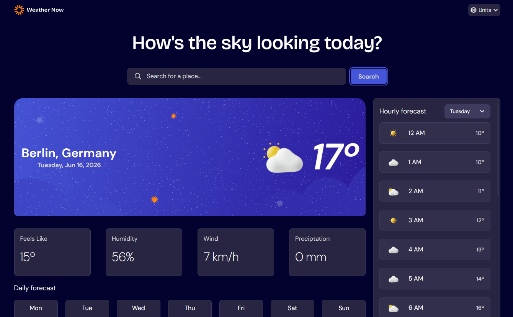

# 📌 Weather App

Site de previsão do tempo.

 

## 🚀 Tecnologias utilizadas

* HTML 5
* CSS 3
* JavaScript
* Vite
* React

 

## 🎯 Funcionalidades

* [ ] Mostra a temperatura média, sensação térmica, humidade, velocidade do vento e precipitação atual;
* [ ] Mostra a temperatura e a representação geral do tempo a cada hora dos dias da semana.

 

## 📸 Preview

 

## 👤 Como interagir com o projeto

Acesse o [link para o site hospedado na Vercel](https://weather-app-theta-ten-87.vercel.app/)

 

## 🧠 Aprendizados

* Trabalhar com estado no React;
* Manipulação de DOM;
* Consumo de API;
* Organização de código.

 

## 🛠️ Melhorias futuras

* [ ] Testes automatizados;
* [ ] Memória das cidades já pesquisadas.

 

## 🙋‍♀️ Autora

Feito por Andressa Tomiozzo.
Esse é um dos desafios do Frontend Mentor.
[LinkedIn](https://www.linkedin.com/in/andressa-tomiozzo/)